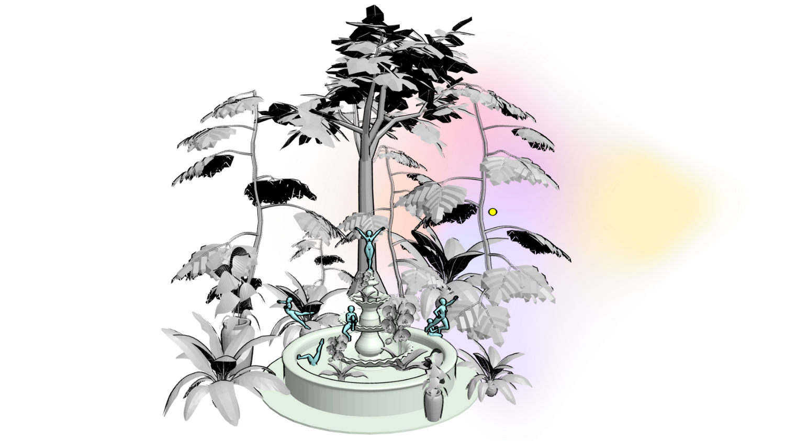
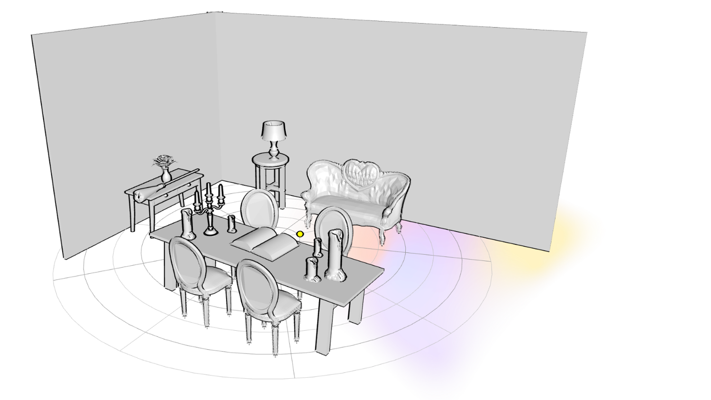
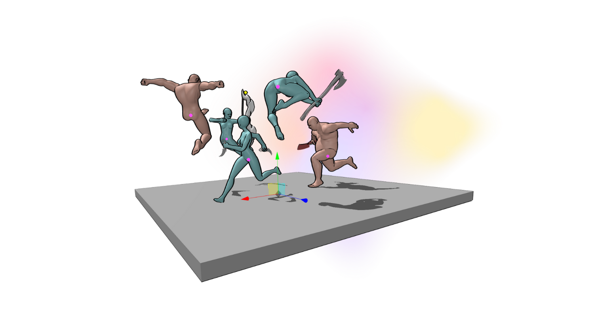
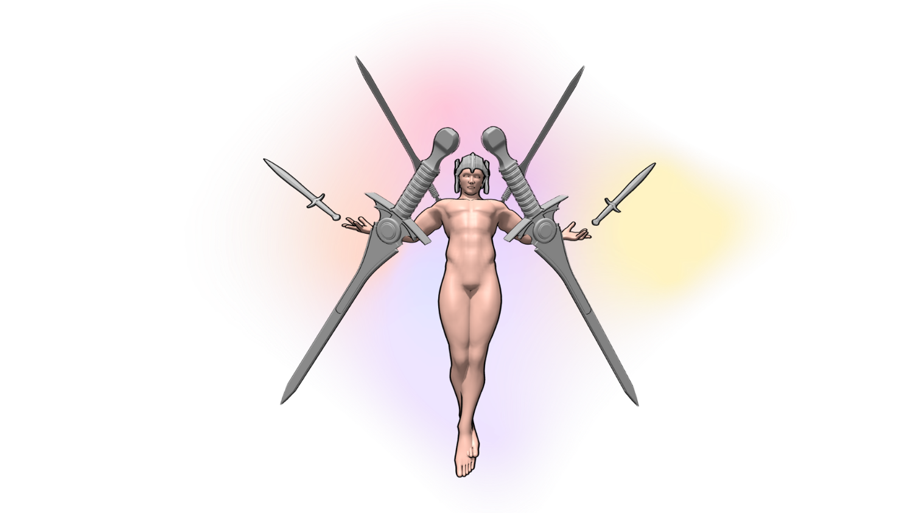
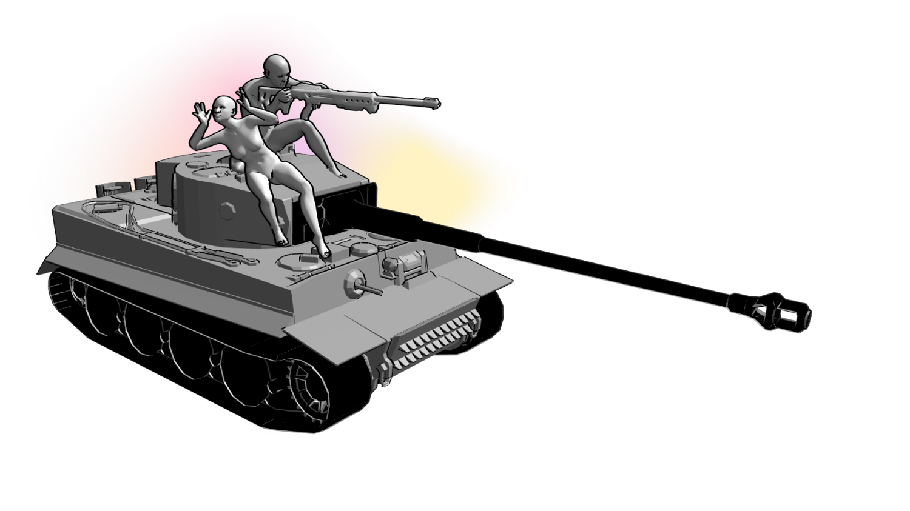
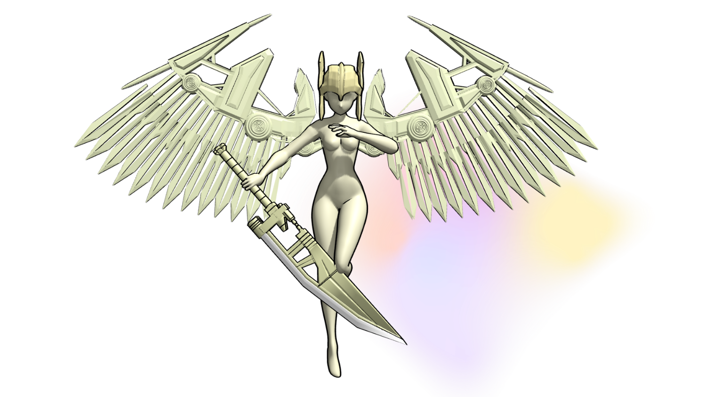
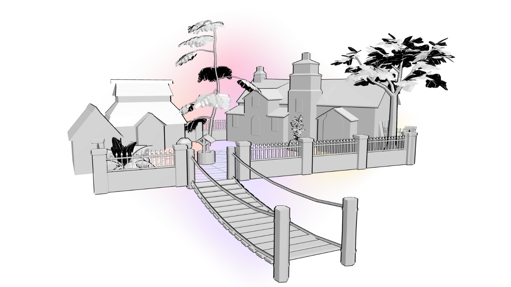
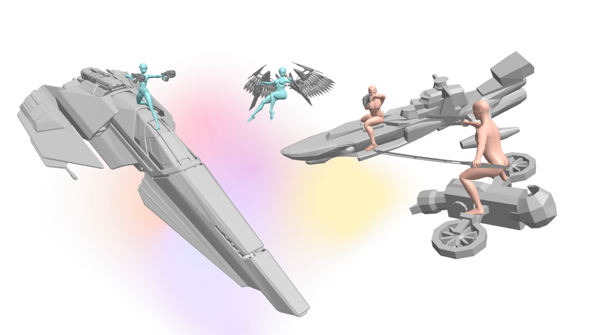
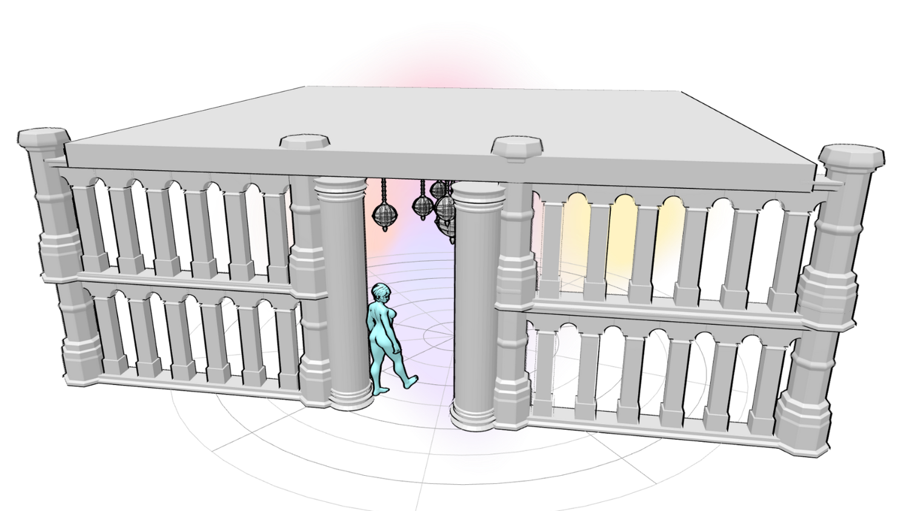

Tucked away in a secret garden, six fairies gather to frolic and flutter and eat little children. It takes them a while but they get there eventually don't stress. 

It was rumoured that Séancé Knowles made an appearance at dinner.

It's pretty safe to say that when you're being chased by a big ol' dude with a cleaver, you should run in the other direction.

God of war who likes long walks on the beach and sunsets. 

Tanks are known for their subtlety.

She has a razor-sharp wit apparently.

Build a bridge and get over it.

The best way to settle a traffic jam in space is with guns, obviously.

How many tomb raiders does it take to raid a tomb?